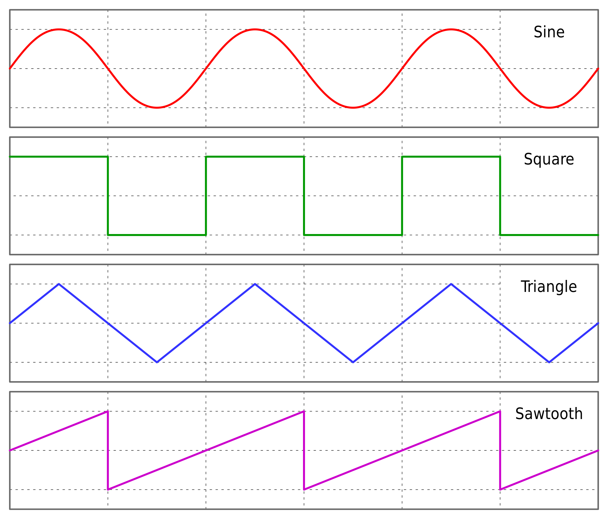
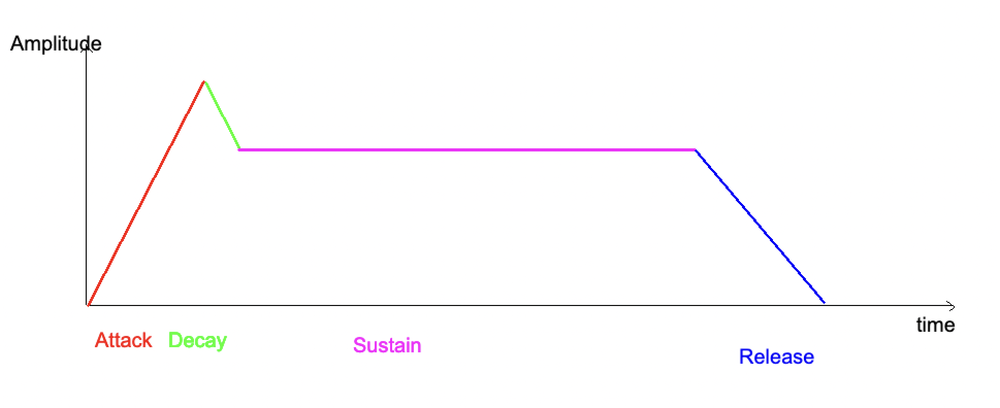
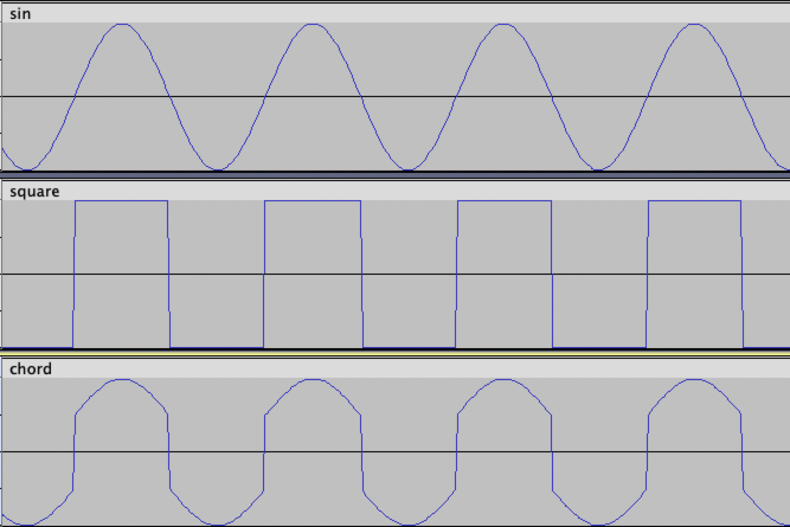

# F# Sound Synthesiser

## Functional Specification

## Team
Aurélien Fernandez  
Max Bernard  
Antonin Pillet  
Quentin Clément  
David Cuahonte Cuevas  
Paul Nowak  

## Stakeholders
Franck Jeannin  
Robert Pickering  

## Objectives

What we need to do is create a sound synthesizer that can be used to create programmable music.
This project is inspired by Sonic Pi (https://sonic-pi.net/) and other live coding music packages. The ultimate aim of this project is to be able to play music from code.

## Requirements

### Basic Waveforms

This program is able to generate 4 types of waveforms: Sinus, Triangle, Sawtooth and Square. 

They can have different types of audible frequencies and we will be using these mathematical formulas to create them: 
- Sinus: amplitude * sin (2 * PI * time * frequence / sampleRate)
- Triangle: 2 * amplitude * (time * frequence/sampleRate - floor (0.5 + time * frequence/sampleRate))
- Sawtooth: amplitude * float (sign (2 * PI * time * frequence/float sampleRate))
- Square: 2 * amplitude * asin (2 * PI * time * frequence/sampleRate) / PI

We also need to create an "empty" waveform which will return with no sound.

### Effects

#### Basic Filters

We need to create filters: 
- A filter to change the amplitude of the waveform.
- A filter to cut the waveform at a specified amplitude to give the “overdriven” effect often used in rock songs.

#### Echo

A filter to create an echo. This effect returns a selected sound inside a file and it will repeat it a defined number of times, each time with a decrasing amplitude.

#### Reverb

A filter to create a reverb, which is a persistence of a sound, or basically an echo that happens after the sound is produced.

#### Flange

This effect is defined by the creation of a copy of the original wave but with a decreasing frequency, then the two sound will be played at the same time.

### Save Waveforms

We will make this, so that the program generates sound files that can be read by any standard audio application. 

### Play Sound

We need to be able to play the sound of the wave (+ filters) that we made before. It has to be saved in a .wav audio file and we also need it to play without saving it.

### Four Stage Envelope

We need to vary the amplitude of the sound through time. The objective is to have the sound start from 0% and ramp up to 100% and then to ramp down to 0% at the end. It should create a sound that is smoother on the ears.  
 
  - Attack : The amplitude of the entire waveform is increasing proggresively from 0 to 100%;
  - Decay : The amplitude decreases from 100% to a predefined lower or equal amplitude;
  - Sustain : The amplitude stays at the predefined amplitude;
  - Release : The amplitude goes from the predefined amplitude to 0.

The amplitude changes, meaning that you don't generate a waveform with the shape of the envelope, but rather multiply the waveform by the amplitude.

### High and Low Pass Filter

- High Pass Filter: Let in high frequencies and attenuate low frequencies.

- Low Pass Filter: It's the opposite of the High Pass Filter.

### Chord

It is the ability to fuse two or more waveforms as in the following picture. 
 
These waves would need to be of the same lenght and their amplitude divided by the number of waves so as not to make theme significantly louder then the other waves

### Optional Functions

Create basic musical notes from A0 to A8 on a piano.
